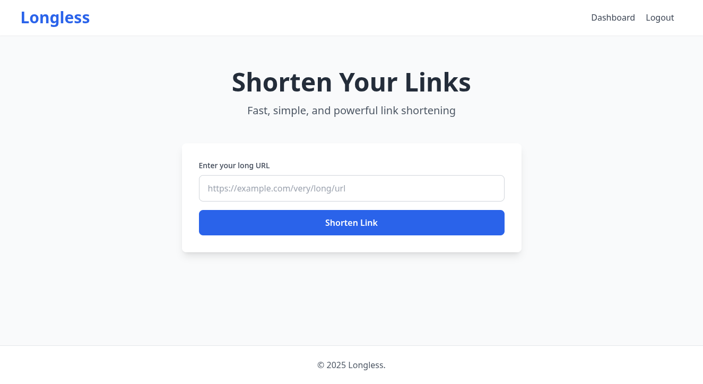

# Longless



#### Video Demo:

https://youtu.be/Ehkfvp1yKjw

#### Description:

Longless is a full-stack URL shortening service built with Node.js and Express. It allows users to create shortened URLs, track clicks, and manage their links through a personalized dashboard.

## Table of contents

- [**Features**](#features)
- [**Technologies Used**](#technologies-used)
  - [Backend](#backend)
  - [Frontend](#frontend)
- [**Database Schema**](#database-schema)
  - [Users Table](#users-table)
  - [URLs Table](#urls-table)
  - [Clicks Table](#clicks-table)
- [**Project Structure**](#project-structure)
- [**Installation & Setup**](#installation--setup)
- [**Credits**](#credits)

## Features

- **User Authentication**: Secure registration and login with bcrypt password hashing
- **URL Shortening**: Generate short, unique alphanumeric codes for long URLs
- **Click Analytics**: Track every click with timestamp, IP address and user agent
- **User Dashboard**: View all your links, clicks statistics, and manage your URLs
- **Link Management**: Copy links to clipboard and delete unwanted URLs
- **Responsive Design**: Clean, modern interface built with Tailwind CSS
- **Production logging** for monitoring and debugging

## Technologies Used

### Backend

- [**Node.js**](https://nodejs.org/en) & [**Express.js**](https://expressjs.com/): Server and routing
- [**SQLite**](https://sqlite.org/) **[(better-sqlite3)](https://github.com/WiseLibs/better-sqlite3)**: Lightweight database with synchronous API
- [**bcrypt.js**](https://github.com/dcodeIO/bcrypt.js/tree/main): Password hashing for security
- [**express-session**](https://github.com/expressjs/session/tree/master): Session management
- [**EJS**](https://ejs.co/): Server-side templating

### Frontend

- [**Tailwind CSS**](https://tailwindcss.com/): Utility-first CSS framework
- **Vanilla Javascript**: Interactive features (copy to clipboard)

## Database Schema

### Users Table

- `id`: Primary key
- `username`: Unique username
- `email`: Unique email
- `hash`: Bcrypt hashed password
- `created_at`: Registration timestamp

### URLs Table

- `id`: Primary key
- `user_id`: Foreign key to users
- `short_code`: Unique short code (e.g., "abc123")
- `original_url`: The original long URL
- `created_at`: Creation timestamp
- `title`: Optional link title

### Clicks Table

- `id`: Primary key
- `url_id`: Foreign key to urls (CASCADE on delete)
- `clicked_at`: Click timestamp
- `ip_address`: Visitor IP
- `user_agent`: Browser/device info

## Project Structure

```
longless/
├── config/
│   ├── database.js       # SQLite connection and schema
│   └── dbHelpers.js      # Database query functions
├── middleware/
│   ├── auth.js           # requireAuth, requireGuest
│   ├── render.js         # Custom render wrapper
│   └── notFound.js       # 404 handler
├── routes/
│   ├── auth.js           # Login, register, logout
│   ├── links.js          # Link CRUD operations
│   └── redirect.js       # Short code redirect
├── utils/
│   └── helpers.js        # generateShortCode, isValidUrl
├── views/
│   ├── layouts/
│   │   └── main.ejs      # Base layout
│   ├── index.ejs         # Landing page
│   ├── login.ejs         # Login page
│   ├── register.ejs      # Registration page
│   ├── dashboard.ejs     # User dashboard
│   ├── notFound.ejs      # Not found page
│   └── error.ejs         # Error page
├── public/
│   └── (static assets)
├── app.js                # Main application file
├── package.json
└── .env                  # Environment variables
```

## Installation & Setup

1.**Clone the repository**

```bash
git clone https://github.com/omaresaa/longless.git

cd longless
```

2.**Install dependencies**

```bash
npm i
```

3.**Set up environment variables**

```bash
cp .env.example .env

# Edit .env and add your SESSION_SECRET
```

4.**Run the application**

```bash
npm run dev
```

5.**Open in browser**

```
http://localhost:3000
```

## Logging System

The application includes comprehensive structured logging for monitoring and debugging:

### Features

- **Structured JSON Format**: Easy to parse and analyze
- **Multiple Log Levels**: INFO, WARN, DEBUG, ERROR
- **Separate Error Logs**: Quick access to failures
- **Contextual Meta Data**: User IDs, timestamps, request details
- **Development Console**: Colored output for easier local debugging

### Log Files

- `log/app.log` - All application logs
- `log/error.log` - Error-level log only

### Logged Events

- User registration and authentication
- Link creation and deletion
- Failed login attempts (security monitoring)
- Short link redirects and clicks
- Application errors with full stack traces
- Invalid URL attempts
- HTTP Requests

Example log entry:

```json
{
  "timestamp": "2025-12-18T15:30:45.123Z",
  "level": "INFO",
  "message": "Link created",
  "userId": 5,
  "shortCode": "abc123",
  "originalUrl": "https://github.com"
}
```

## Credits

Created by Omar Esa for CS50x Final Project.
